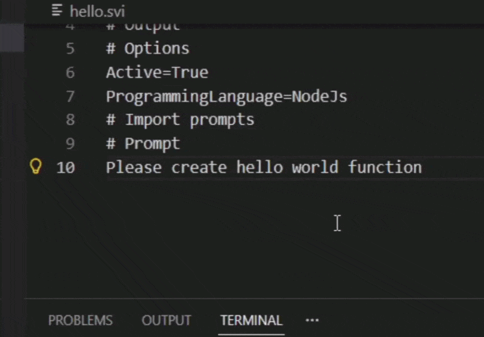

# SVI - Structured Vibe Coding




SVI is a CLI tool that turns LLM code generation into a deterministic build step.

It brings the reliability of traditional build systems to LLM code generation.

Define prompts as Markdown-based `.svi` files, version them like source code, and generate consistent outputs — without hidden context, chat history, or guesswork:

1. write `auth.svi`
2. run `svi run`
3. produce a consistent `auth.ts`

`.svi` files use a Markdown-like structure, making them easy to read, write, and version control.

Think of `.svi` files as source code, and generation as compilation.

### Why this matters

LLM tools are great for prototyping — but become unreliable in real projects:

- outputs drift over time
- prompts become untraceable
- results depend on implicit context

SVI fixes this by making code generation explicit, versioned, and reproducible.

## Why SVI?

- Enable reproducible AI code generation — the same input produces consistent outputs across runs
- Keep generated code stable and predictable as your project grows
- Reduce token usage by limiting context to explicit dependencies
- Eliminate copy-paste between chat and your codebase

## Works with existing projects

SVI is designed for incremental adoption.

You don't need to generate your entire codebase with SVI.  
You can use it only for selected files, while the rest of your project remains handwritten.

This makes it easy to introduce SVI into existing projects without disruption.

# The problem

- Agents work well for small projects but become unreliable as codebases grow
- Outputs become inconsistent and hard to trust over time
- High token usage leads to high cost
- Chat-based workflows lack persistent, controllable context

# The solution

SVI introduces a deterministic, file-based workflow for code generation — where each output file is derived from an explicit, version-controlled prompt.

You control:

- what gets generated
- what context is used
- how files depend on each other

No hidden state. No chat history. Just reproducible outputs.

## How it works

- **File-based generation**
  Each file is generated from its own `.svi` specification
- **Controlled context size**
  You explicitly define dependencies - smaller prompts, lower cost
- **Prompt modularity**
  Compose prompts like modules
- **Model-aware scaling**
  Use larger files with strong models, and smaller units with weaker ones

# Getting started

## Install

```bash
npm install -g @avrm/svi
```

## Initialize

Create the project configuration file:

```bash
svi init
```

Example `svi.json`:

```json
{
  "programmingLanguage": "TypeScript",
  "searchPaths": ["**/*"],
  "ignorePaths": []
}
```

## Configure environment

```env
API_KEY=<your API key>
MODEL_NAME=<model name>, e.g., gemini-2.5-flash
SERVICE=<service name>, e.g., google
```

## Write prompts

Create a prompt file:

```bash
svi init hello.svi
```

Example:

```md
# Destination File

hello.js

# Output

function hello()

# Options

ProgrammingLanguage=Node.js
Active=True

# Prompt

Create a function that prints "Hello World", and call this function
```

## Run

```bash
svi run
```

Output:

```javascript
// hello.js
function hello() {
  console.log("Hello World");
}
hello();
```

# Documentation

- [Reference](docs/reference/contents.md)
- [Solution Overview](docs/solution-description.md)
- [Technical Details](docs/solution-technical-description.md)
- [`.svi` format](docs/reference/svi-file-format.md)
- [Contribution guide](docs/CONTRIBUTION.md)

# Acknowledgement

Thanks to [LLM.js](https://github.com/themaximalist/llm.js/) for multi-model support.
